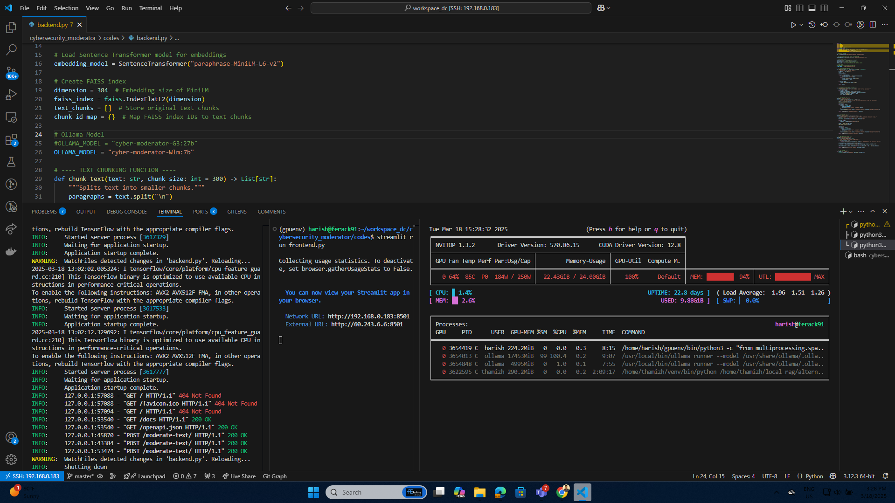
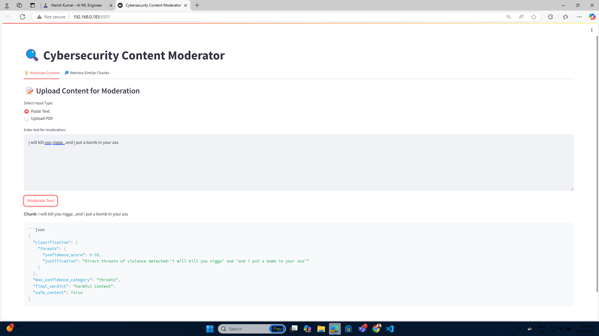
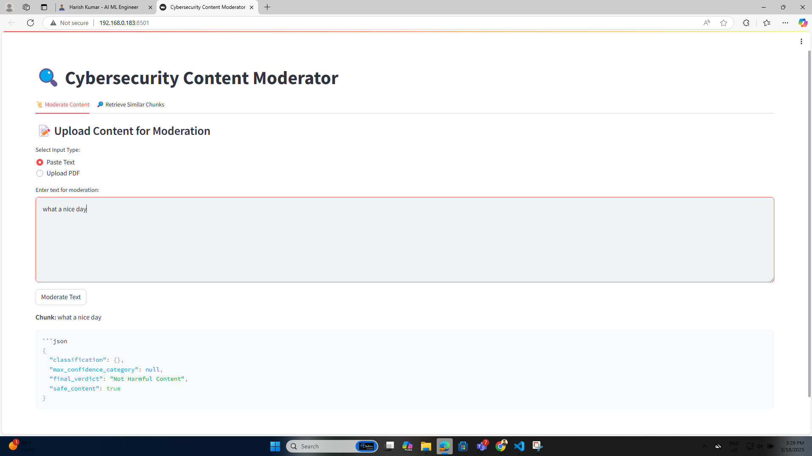

# Cybersecurity Content Moderator

## Overview
This project is a **Cybersecurity Content Moderator** that uses an **Ollama LLM model** (`cyber-moderator-G3:27b`) to detect and classify harmful content. It integrates **FastAPI** for the backend and **Streamlit** for the frontend, with **FAISS** for efficient similarity search.

## Features
- **Text & PDF Moderation**: Supports both plain text and PDF files.
- **AI-Powered Content Analysis**: Uses a custom-trained Ollama model.
- **Semantic Search**: Retrieves similar content using **FAISS** and **Sentence Transformers**.
- **User-Friendly UI**: Built with Streamlit.

## Installation

### Prerequisites
Ensure you have the following installed:
- Python 3.10+
- Ollama installed and running
- GPU support for model inference (recommended)

### Clone the Repository
```bash
git clone https://github.com/your-repo/cybersecurity_moderator.git
cd cybersecurity_moderator/codes
```

### Create a Virtual Environment
```bash
python -m venv gpuenv
source gpuenv/bin/activate  # On Linux/macOS
gpuenv\Scripts\activate  # On Windows
```

### Install Dependencies
```bash
pip install -r requirements.txt
```

## Model Setup
Ensure the **Ollama model** is available:
```bash
ollama list
```
If the model is missing, pull it:
```bash
ollama pull cyber-moderator-G3:27b
```
If you want to create model from base model:
## Setting Up and Running the Ollama Model

### 1️⃣ Create and Configure the Ollama Model File

Navigate to the `modelfiles` directory and create an Ollama `Modelfile`:

```bash
cd /home/harish/workspace_dc/cybersecurity_moderator/modelfiles/
nano Modelfile
```

Inside the `Modelfile`, define your model configuration. Example:

```plaintext
# Ollama Model Configuration File
# Path: /home/harish/workspace_dc/cybersecurity_moderator/modelfiles/Modelfile

FROM llama3.3:70b
SYSTEM "Cybersecurity content moderation model"
PARAMETER "temperature" 0.7
PARAMETER "top_p" 0.9
```

Save and exit (`Ctrl + X`, then `Y`, and `Enter`).

### 2️⃣ Build the Ollama Model

Run the following command to build the model:

```bash
ollama create cyber-moderator-G3:27b -f /home/harish/workspace_dc/cybersecurity_moderator/modelfiles/Modelfile
```

This will register the model as `cyber-moderator-G3:27b`.

### 3️⃣ Verify the Model

To check if the model is available:

```bash
ollama list
```

You should see `cyber-moderator-G3:27b` in the list.

### 4️⃣ Start Using the Model

Test the model with:

```bash
ollama run cyber-moderator-G3:27b "Analyze this message for harmful content."
```

Once confirmed, your FastAPI backend will automatically use this model for moderation tasks.


## Running the Application

### Start the Backend (FastAPI)
```bash
uvicorn backend:app --host 0.0.0.0 --port 8000 --reload
```

### Start the Frontend (Streamlit)
```bash
streamlit run frontend.py
```

## Usage
1. **Text Moderation**: Paste text and analyze it.
2. **PDF Moderation**: Upload a PDF file for content analysis.
3. **Retrieve Similar Content**: Enter a query to find similar content.

## API Endpoints
| Endpoint         | Method | Description |
|-----------------|--------|-------------|
| `/upload-text/` | POST   | Accepts text for moderation |
| `/upload-pdf/`  | POST   | Accepts a PDF file for analysis |
| `/retrieve-chunks/` | GET | Retrieves similar content |

## Output Screenshots

### Backend Processing Output


### Streamlit Moderation Interface-Output


### Streamlit Moderation Interface-Output


## Troubleshooting
- If you get a `Connection Refused` error, ensure **FastAPI** is running before launching Streamlit.
- If the model is not found, verify **Ollama** is running and the correct model is installed.

## License
This project is licensed under the MIT License.

---
Feel free to contribute and improve the project!